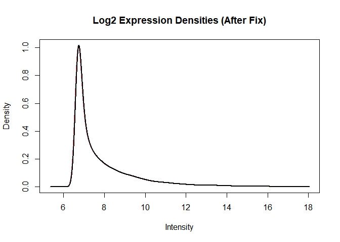
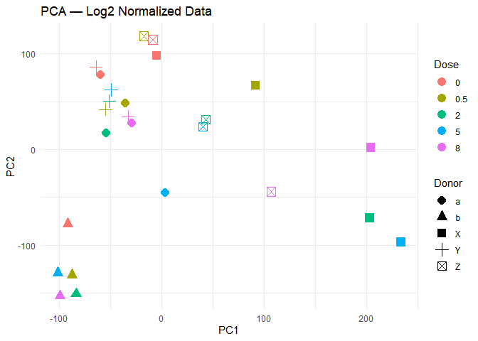
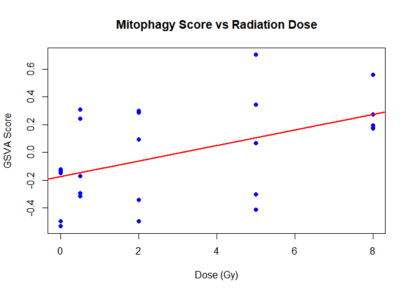
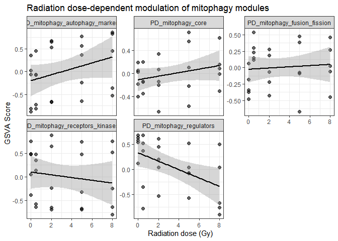
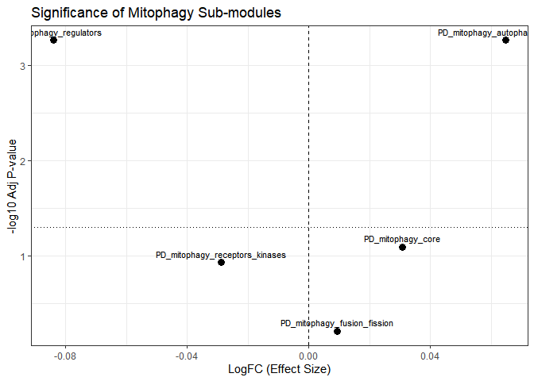
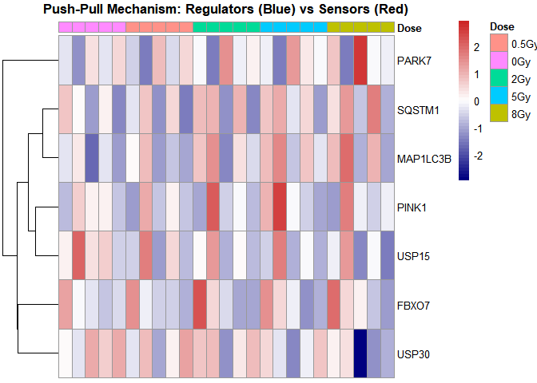
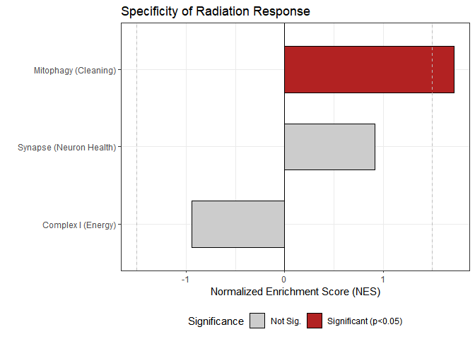
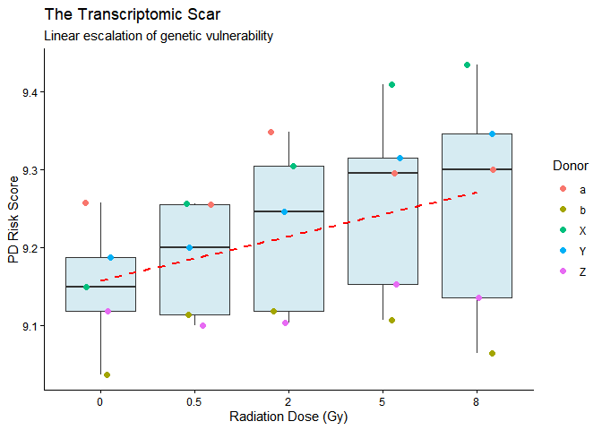

Full_Research_Log.R
================
arthu
2025-12-15

``` r
# ==============================================================================
# PROJECT: Radiation Analysis (GLDS-157 / Agilent Microarray)
# AUTHOR: Arthur Pelozo
# STATUS: CORRECTED (Log2 Transformation + Direct Plotting)
# ==============================================================================

# 1. SETUP AND LIBRARIES -------------------------------------------------------

setwd("C:/Users/arthu/Downloads/projeto_radiacao_PD")

# Load libraries
suppressPackageStartupMessages({
  library(limma)
  library(edgeR)
  library(sva)
  library(biomaRt)
  library(fgsea)
  library(msigdbr)
  library(GSVA)
  library(pheatmap)
  library(ggplot2)
  library(RColorBrewer)
  library(org.Hs.eg.db)
  library(AnnotationDbi)
  library(readr)
  library(dplyr)
  library(tibble)
  library(stringr)
  library(cowplot)
  library(data.table)
})

# 2. METADATA CREATION ---------------------------------------------------------

# List files and create targets
files <- list.files("data", pattern = "\\.txt$", full.names = TRUE)
targets <- data.frame(FileName = files, BaseName = basename(files), stringsAsFactors = FALSE)

# Filter for experimental files
targets <- targets[grepl("_[A-Za-z]_[0-9\\.]+Gy", targets$BaseName), ]

# Extract Metadata
targets$Dose <- str_extract(targets$BaseName, "[0-9\\.]+Gy")
targets$DoseNum <- as.numeric(str_extract(targets$Dose, "[0-9\\.]+"))
targets$Donor <- str_extract(targets$BaseName, "_([A-Za-z])_")
targets$Donor <- gsub("_", "", targets$Donor)
targets$SampleID <- gsub("\\.txt$", "", targets$BaseName)

# Verify Design
print(table(targets$Donor, targets$DoseNum))
```

    ##    
    ##     0 0.5 2 5 8
    ##   a 1   1 1 1 1
    ##   b 1   1 1 1 1
    ##   X 1   1 1 1 1
    ##   Y 1   1 1 1 1
    ##   Z 1   1 1 1 1

``` r
# 3. DATA IMPORT AND NORMALIZATION (THE FIX) -----------------------------------

message("Reading Agilent files...")
```

    ## Reading Agilent files...

``` r
RG <- read.maimages(targets$FileName, source = "agilent", green.only = TRUE)
```

    ## Read data/GSM1080614_a_0.5Gy.txt 
    ## Read data/GSM1080615_a_0Gy.txt 
    ## Read data/GSM1080616_a_2Gy.txt 
    ## Read data/GSM1080617_a_5Gy.txt 
    ## Read data/GSM1080618_a_8Gy.txt 
    ## Read data/GSM1080619_b_0.5Gy.txt 
    ## Read data/GSM1080620_b_0Gy.txt 
    ## Read data/GSM1080621_b_2Gy.txt 
    ## Read data/GSM1080622_b_5Gy.txt 
    ## Read data/GSM1080623_b_8Gy.txt 
    ## Read data/GSM1080649_X_0.5Gy.txt 
    ## Read data/GSM1080650_X_0Gy.txt 
    ## Read data/GSM1080651_X_2Gy.txt 
    ## Read data/GSM1080652_X_5Gy.txt 
    ## Read data/GSM1080653_X_8Gy.txt 
    ## Read data/GSM1080654_Y_0.5Gy.txt 
    ## Read data/GSM1080655_Y_0Gy.txt 
    ## Read data/GSM1080656_Y_2Gy.txt 
    ## Read data/GSM1080657_Y_5Gy.txt 
    ## Read data/GSM1080658_Y_8Gy.txt 
    ## Read data/GSM1080659_Z_0.5Gy.txt 
    ## Read data/GSM1080660_Z_0Gy.txt 
    ## Read data/GSM1080661_Z_2Gy.txt 
    ## Read data/GSM1080662_Z_5Gy.txt 
    ## Read data/GSM1080663_Z_8Gy.txt

``` r
# A. Background Correction (NormExp + Offset)
RG.bc <- backgroundCorrect(RG, method = "normexp", offset = 50)
```

    ## Array 1 corrected
    ## Array 2 corrected
    ## Array 3 corrected
    ## Array 4 corrected
    ## Array 5 corrected
    ## Array 6 corrected
    ## Array 7 corrected
    ## Array 8 corrected
    ## Array 9 corrected
    ## Array 10 corrected
    ## Array 11 corrected
    ## Array 12 corrected
    ## Array 13 corrected
    ## Array 14 corrected
    ## Array 15 corrected
    ## Array 16 corrected
    ## Array 17 corrected
    ## Array 18 corrected
    ## Array 19 corrected
    ## Array 20 corrected
    ## Array 21 corrected
    ## Array 22 corrected
    ## Array 23 corrected
    ## Array 24 corrected
    ## Array 25 corrected

``` r
# B. *** THE CRITICAL FIX: LOG2 TRANSFORMATION ***
message("Applying Log2 transformation...")
```

    ## Applying Log2 transformation...

``` r
E_log <- log2(RG.bc$E)

# C. Quantile Normalization
expr_matrix <- normalizeBetweenArrays(E_log, method = "quantile")
colnames(expr_matrix) <- targets$SampleID

# D. Verification Plot (Density)
# Direct plot to device
plotDensities(expr_matrix, main = "Log2 Expression Densities (After Fix)", legend = FALSE)
```

<!-- -->

``` r
# 4. QC: PCA -------------------------------------------------------------------

expr_no_na <- expr_matrix[complete.cases(expr_matrix), ]
pca <- prcomp(t(expr_no_na), scale. = TRUE)

df_pca <- data.frame(
  PC1 = pca$x[, 1],
  PC2 = pca$x[, 2],
  Dose = as.factor(targets$DoseNum),
  Donor = as.factor(targets$Donor)
)

p_pca <- ggplot(df_pca, aes(PC1, PC2, color = Dose, shape = Donor)) +
  geom_point(size = 4) +
  theme_minimal() +
  labs(title = "PCA — Log2 Normalized Data")

print(p_pca) # Generating the plot
```

<!-- -->

``` r
# 5. DIFFERENTIAL EXPRESSION (LIMMA) -------------------------------------------

targets$Donor <- factor(targets$Donor)
targets$DoseNum <- as.numeric(targets$DoseNum)

# Design Matrix
design <- model.matrix(~ DoseNum + Donor, data = targets)

# Fit Model
fit <- lmFit(expr_matrix, design)
fit <- eBayes(fit)

# Extract Results (Dose Trend)
res_trend <- topTable(fit, coef = "DoseNum", number = Inf, sort.by = "P")

# SANITY CHECK
print(head(res_trend))
```

    ##            logFC  AveExpr         t      P.Value    adj.P.Val        B
    ## 13976  0.0868836 6.996234  12.73918 1.371642e-11 3.192722e-07 16.66122
    ## 10483  0.1025121 7.600621  12.71709 1.418515e-11 3.192722e-07 16.62739
    ## 29838  0.3184166 8.780318  11.92809 4.857272e-11 7.288337e-07 15.38643
    ## 19380  0.1898995 8.405421  10.80206 3.137936e-10 3.531355e-06 13.49998
    ## 23949 -0.1430879 8.573592 -10.49212 5.372212e-10 4.111824e-06 12.95533
    ## 36669 -0.1427877 9.149288 -10.48073 5.480605e-10 4.111824e-06 12.93509

``` r
# 6. ANNOTATION AND GENE COLLAPSING --------------------------------------------

probe2gene <- RG$genes$GeneName
valid <- !is.na(probe2gene) & probe2gene != "" & 
  probe2gene != "DarkCorner" & probe2gene != "GE_BrightCorner"

expr_valid <- expr_matrix[valid, ]
gene_valid <- probe2gene[valid]

# Collapse to Gene Level
expr_by_gene <- limma::avereps(expr_valid, ID = gene_valid)

# Re-run Limma on Gene Level
fit_gene <- lmFit(expr_by_gene, design)
fit_gene <- eBayes(fit_gene)
gene_ranking <- fit_gene$t[, "DoseNum"]

# Filter for HGNC
valid_hgnc <- keys(org.Hs.eg.db, keytype = "SYMBOL")
ranking_valid <- gene_ranking[names(gene_ranking) %in% valid_hgnc]
ranking_valid <- sort(ranking_valid, decreasing = TRUE)

# 7. GLOBAL GSEA (RE-CHECK) ----------------------------------------------------

m_df <- msigdbr(species = "Homo sapiens")
hallmark_list <- split(m_df[m_df$gs_collection == "H", ]$gene_symbol, 
                       m_df[m_df$gs_collection == "H", ]$gs_name)

kegg_df <- m_df[m_df$gs_subcollection %in% c("CP:KEGG_LEGACY", "CP:KEGG_MEDICUS"), ]
kegg_list <- split(kegg_df$gene_symbol, kegg_df$gs_name)

message("Running GSEA on Log2 data...")
```

    ## Running GSEA on Log2 data...

``` r
gsea_hallmark <- fgseaMultilevel(pathways = hallmark_list, stats = ranking_valid, eps = 0)
```

    ## Warning in serialize(data, node$con): 'package:stats' pode não estar disponível ao
    ## carregar
    ## Warning in serialize(data, node$con): 'package:stats' pode não estar disponível ao
    ## carregar
    ## Warning in serialize(data, node$con): 'package:stats' pode não estar disponível ao
    ## carregar
    ## Warning in serialize(data, node$con): 'package:stats' pode não estar disponível ao
    ## carregar
    ## Warning in serialize(data, node$con): 'package:stats' pode não estar disponível ao
    ## carregar
    ## Warning in serialize(data, node$con): 'package:stats' pode não estar disponível ao
    ## carregar
    ## Warning in serialize(data, node$con): 'package:stats' pode não estar disponível ao
    ## carregar
    ## Warning in serialize(data, node$con): 'package:stats' pode não estar disponível ao
    ## carregar
    ## Warning in serialize(data, node$con): 'package:stats' pode não estar disponível ao
    ## carregar
    ## Warning in serialize(data, node$con): 'package:stats' pode não estar disponível ao
    ## carregar
    ## Warning in serialize(data, node$con): 'package:stats' pode não estar disponível ao
    ## carregar

``` r
gsea_kegg <- fgseaMultilevel(pathways = kegg_list, stats = ranking_valid, eps = 0)
```

    ## Warning in serialize(data, node$con): 'package:stats' pode não estar disponível ao
    ## carregar
    ## Warning in serialize(data, node$con): 'package:stats' pode não estar disponível ao
    ## carregar
    ## Warning in serialize(data, node$con): 'package:stats' pode não estar disponível ao
    ## carregar
    ## Warning in serialize(data, node$con): 'package:stats' pode não estar disponível ao
    ## carregar
    ## Warning in serialize(data, node$con): 'package:stats' pode não estar disponível ao
    ## carregar
    ## Warning in serialize(data, node$con): 'package:stats' pode não estar disponível ao
    ## carregar
    ## Warning in serialize(data, node$con): 'package:stats' pode não estar disponível ao
    ## carregar
    ## Warning in serialize(data, node$con): 'package:stats' pode não estar disponível ao
    ## carregar
    ## Warning in serialize(data, node$con): 'package:stats' pode não estar disponível ao
    ## carregar
    ## Warning in serialize(data, node$con): 'package:stats' pode não estar disponível ao
    ## carregar
    ## Warning in serialize(data, node$con): 'package:stats' pode não estar disponível ao
    ## carregar
    ## Warning in serialize(data, node$con): 'package:stats' pode não estar disponível ao
    ## carregar
    ## Warning in serialize(data, node$con): 'package:stats' pode não estar disponível ao
    ## carregar
    ## Warning in serialize(data, node$con): 'package:stats' pode não estar disponível ao
    ## carregar
    ## Warning in serialize(data, node$con): 'package:stats' pode não estar disponível ao
    ## carregar

``` r
# Sort
gsea_hallmark <- as.data.table(gsea_hallmark)[order(padj)]
gsea_kegg <- as.data.table(gsea_kegg)[order(padj)]

# Check Parkinson's result
print(gsea_kegg[gsea_kegg$pathway == "KEGG_PARKINSONS_DISEASE"])
```

    ##                    pathway      pval      padj    log2err        ES       NES  size
    ##                     <char>     <num>     <num>      <num>     <num>     <num> <int>
    ## 1: KEGG_PARKINSONS_DISEASE 0.9873817 0.9929848 0.06767604 0.1470796 0.6492193    91
    ##     leadingEdge
    ##          <list>
    ## 1: SNCA, CY....

``` r
# ==============================================================================
# PART 2: TARGETED PATHWAY ANALYSIS & MITOPHAGY DISSECTION
# ==============================================================================

# 1. VERIFICATION OF INPUTS ----------------------------------------------------

stopifnot(exists("expr_by_gene") && is.matrix(expr_by_gene))
stopifnot(exists("ranking_valid") && is.numeric(ranking_valid))

# 2. DEFINING SPECIFIC PD SUB-PATHWAYS -----------------------------------------

PD_mito_complexI <- c(
  "NDUFS1","NDUFS2","NDUFS3","NDUFS4","NDUFS7","NDUFS8",
  "NDUFV1","NDUFV2","NDUFA2","NDUFA8","NDUFA9",
  "NDUFB9","NDUFB10","NDUFB8"
)

PD_mitophagy_PINK1_PRKN <- c(
  "PINK1","PRKN","PARK7","UCHL1","SNCAIP","SNCA",
  "FBXO7","ATP13A2"
)

PD_dopaminergic_synapse <- c(
  "TH","SLC6A3","DDC","DRD2","SLC18A2","SLC18A1"
)

custom_pd <- list(
  PD_mito_complexI = PD_mito_complexI,
  PD_mitophagy_PINK1_PRKN = PD_mitophagy_PINK1_PRKN,
  PD_dop_synapse = PD_dopaminergic_synapse
)

# 3. RUNNING TARGETED GSEA (fgsea) ---------------------------------------------

library(fgsea)

pd_fgsea <- fgseaMultilevel(
  pathways = custom_pd,
  stats = sort(ranking_valid, decreasing = TRUE),
  eps = 0
)
```

    ## Warning in serialize(data, node$con): 'package:stats' pode não estar disponível ao
    ## carregar

``` r
print(pd_fgsea)
```

    ##                    pathway       pval       padj    log2err         ES        NES
    ##                     <char>      <num>      <num>      <num>      <num>      <num>
    ## 1:          PD_dop_synapse 0.65957447 0.65957447 0.06815134  0.3825591  0.8357505
    ## 2:        PD_mito_complexI 0.61937716 0.65957447 0.06116926 -0.3230377 -0.8674977
    ## 3: PD_mitophagy_PINK1_PRKN 0.02290251 0.06870752 0.35248786  0.7182131  1.6443976
    ##     size  leadingEdge
    ##    <int>       <list>
    ## 1:     6 DRD2, TH....
    ## 2:    14 NDUFB9, ....
    ## 3:     7 SNCA, SN....

``` r
# 4. SAMPLE-LEVEL ENRICHMENT (GSVA) --------------------------------------------

library(GSVA)

gsva_param <- gsvaParam(
  expr = as.matrix(expr_by_gene),
  geneSets = custom_pd,
  kcdf = "Gaussian"
)

gsva_scores <- gsva(gsva_param)
```

    ## ℹ GSVA version 2.4.1

    ## ℹ Searching for genes/features with constant values

    ## ℹ Calculating GSVA ranks

    ## ℹ GSVA dense (classical) algorithm

    ## ℹ Row-wise ECDF estimation with Gaussian kernels

    ## ℹ Calculating row ECDFs

    ## ℹ Calculating column ranks

    ## ℹ GSVA dense (classical) algorithm

    ## ℹ Calculating GSVA scores

    ## ✔ Calculations finished

``` r
# 5. LINEAR MODELING OF PATHWAY SCORES -----------------------------------------

fit_gsva <- lmFit(gsva_scores, design)
fit_gsva <- eBayes(fit_gsva)

res_gsva <- topTable(fit_gsva, coef = "DoseNum", number = Inf)
print(res_gsva)
```

    ##                               logFC      AveExpr          t      P.Value   adj.P.Val
    ## PD_mitophagy_PINK1_PRKN  0.05630174 -0.001730152  3.8371071 0.0003982276 0.001194683
    ## PD_mito_complexI        -0.01550952 -0.003088286 -1.1394970 0.2607302289 0.391095343
    ## PD_dop_synapse           0.01362796 -0.011488163  0.8249081 0.4139233777 0.413923378
    ##                                  B
    ## PD_mitophagy_PINK1_PRKN -0.1903243
    ## PD_mito_complexI        -5.8757799
    ## PD_dop_synapse          -6.1780690

``` r
# Quick visualization of the strongest hit (Mitophagy) - Direct Plot
plot(targets$DoseNum, gsva_scores["PD_mitophagy_PINK1_PRKN", ],
     main = "Mitophagy Score vs Radiation Dose",
     xlab = "Dose (Gy)", ylab = "GSVA Score", pch=19, col="blue")
abline(lm(gsva_scores["PD_mitophagy_PINK1_PRKN", ] ~ targets$DoseNum), col="red", lwd=2)
```

<!-- -->

``` r
# 6. INTERACTION ANALYSIS (DOSE x DONOR) ---------------------------------------

design_int <- model.matrix(~ DoseNum * Donor, data = targets)
fit_int <- lmFit(gsva_scores, design_int)
fit_int <- eBayes(fit_int)
res_int <- topTable(fit_int, coef = grep("DoseNum:Donor", colnames(design_int), value = TRUE))
print(res_int)
```

    ##                         DoseNum.Donorb DoseNum.DonorX DoseNum.DonorY DoseNum.DonorZ
    ## PD_dop_synapse             0.022190341     0.07804008     0.04286106    0.095819097
    ## PD_mito_complexI          -0.009323923     0.02099968     0.02548531   -0.027143335
    ## PD_mitophagy_PINK1_PRKN   -0.004628387     0.04405187     0.02271397   -0.002022905
    ##                              AveExpr         F   P.Value adj.P.Val
    ## PD_dop_synapse          -0.011488163 1.1607230 0.3337702 0.8399446
    ## PD_mito_complexI        -0.003088286 0.4073270 0.8029114 0.8399446
    ## PD_mitophagy_PINK1_PRKN -0.001730152 0.3549462 0.8399446 0.8399446

``` r
# 7. DEEP DIVE: MITOPHAGY SUB-MODULES ------------------------------------------

PD_mitophagy_core <- c("PINK1", "PRKN", "PARK7", "FBXO7", "ATP13A2")
PD_mitophagy_regulators <- c("USP30", "USP15")
PD_mitophagy_receptors_kinases <- c("OPTN", "CALCOCO2", "TBK1")
PD_mitophagy_fusion_fission <- c("MFN1", "MFN2", "DNM1L")
PD_mitophagy_autophagy_markers <- c("SQSTM1", "MAP1LC3B")

custom_pd_mitophagy <- list(
  PD_mitophagy_core = PD_mitophagy_core,
  PD_mitophagy_regulators = PD_mitophagy_regulators,
  PD_mitophagy_receptors_kinases = PD_mitophagy_receptors_kinases,
  PD_mitophagy_fusion_fission = PD_mitophagy_fusion_fission,
  PD_mitophagy_autophagy_markers = PD_mitophagy_autophagy_markers
)

gsva_param_mitophagy <- gsvaParam(
  expr = as.matrix(expr_by_gene),
  geneSets = custom_pd_mitophagy,
  kcdf = "Gaussian"
)
gsva_scores_mitophagy <- gsva(gsva_param_mitophagy)
```

    ## ℹ GSVA version 2.4.1

    ## ℹ Searching for genes/features with constant values

    ## ℹ Calculating GSVA ranks

    ## ℹ GSVA dense (classical) algorithm

    ## ℹ Row-wise ECDF estimation with Gaussian kernels

    ## ℹ Calculating row ECDFs

    ## ℹ Calculating column ranks

    ## ℹ GSVA dense (classical) algorithm

    ## ℹ Calculating GSVA scores

    ## ✔ Calculations finished

``` r
fit_mitophagy <- lmFit(gsva_scores_mitophagy, design)
fit_mitophagy <- eBayes(fit_mitophagy)
res_mitophagy <- topTable(fit_mitophagy, coef = "DoseNum", number = Inf)
print(res_mitophagy)
```

    ##                                       logFC       AveExpr         t      P.Value
    ## PD_mitophagy_autophagy_markers  0.064632351  0.0001817268  4.327556 0.0001137055
    ## PD_mitophagy_regulators        -0.083816867  0.0670571331 -4.109655 0.0002170196
    ## PD_mitophagy_core               0.030774271 -0.0148892115  2.047962 0.0478701367
    ## PD_mitophagy_receptors_kinases -0.028867431  0.0099630168 -1.726972 0.0926975373
    ## PD_mitophagy_fusion_fission     0.009270048  0.0022088917  0.515228 0.6095256963
    ##                                   adj.P.Val          B
    ## PD_mitophagy_autophagy_markers 0.0005425489  1.0752466
    ## PD_mitophagy_regulators        0.0005425489  0.4652022
    ## PD_mitophagy_core              0.0797835611 -4.4571793
    ## PD_mitophagy_receptors_kinases 0.1158719216 -5.0082432
    ## PD_mitophagy_fusion_fission    0.6095256963 -6.3102573

``` r
# 8. VISUALIZATION OF MITOPHAGY MODULES ----------------------------------------

library(tidyverse)

gsva_long <- gsva_scores_mitophagy %>%
  as.data.frame() %>%
  rownames_to_column("Pathway") %>%
  pivot_longer(cols = -Pathway, names_to = "SampleID", values_to = "GSVA_score") %>%
  left_join(targets %>% select(SampleID, DoseNum, Donor), by = "SampleID")

# Plot 1: Dose response per module
p_dose_mod <- ggplot(gsva_long, aes(x = DoseNum, y = GSVA_score)) +
  geom_point(alpha = 0.6, size = 2) +
  geom_smooth(method = "lm", se = TRUE, color = "black") +
  facet_wrap(~ Pathway, scales = "free_y") +
  labs(title = "Radiation dose-dependent modulation of mitophagy modules",
       x = "Radiation dose (Gy)", y = "GSVA Score") +
  theme_bw()

print(p_dose_mod) # Generating the plot
```

    ## `geom_smooth()` using formula = 'y ~ x'

<!-- -->

``` r
# Plot 2: Effect sizes
effect_df <- res_mitophagy %>% as.data.frame() %>% rownames_to_column("Pathway")

p_volcano_mod <- ggplot(effect_df, aes(x = logFC, y = -log10(adj.P.Val), label = Pathway)) +
  geom_point(size = 3) +
  geom_text(vjust = -0.7, size = 3) +
  geom_vline(xintercept = 0, linetype = "dashed") +
  geom_hline(yintercept = -log10(0.05), linetype = "dotted") +
  labs(title = "Significance of Mitophagy Sub-modules",
       x = "LogFC (Effect Size)", y = "-log10 Adj P-value") +
  theme_bw()

print(p_volcano_mod) # Generating the plot
```

<!-- -->

``` r
# 9. RISK SCORE & MEDIATION ANALYSIS -------------------------------------------

pd_risk_genes <- c("SNCA", "LRRK2", "PINK1", "PRKN", "PARK7", "DJ1", "ATP13A2", 
                   "FBXO7", "UCHL1", "NDUFS1", "NDUFS2", "NDUFV1", "NDUFA8", 
                   "VDAC1", "VDAC2", "GBA", "CTSD", "LAMP1", "LAMP2", 
                   "TH", "SLC6A3", "SLC18A2", "DDC")

mitophagy_core_genes <- c("PINK1", "PRKN", "PARK7", "FBXO7", "ATP13A2", "SNCA", "UCHL1", "SNCAIP")

pd_genes_clean <- setdiff(pd_risk_genes, mitophagy_core_genes)
pd_genes_clean <- intersect(pd_genes_clean, rownames(expr_by_gene))

# Calculate Scores
pd_risk_score_clean <- colMeans(expr_by_gene[pd_genes_clean, ], na.rm = TRUE)
targets$PD_Risk_Score_Clean <- pd_risk_score_clean[targets$SampleID]
targets$Mitophagy_Core_GSVA <- gsva_scores_mitophagy["PD_mitophagy_core", ]

# Mediation Models
message("--- Model A: Radiation -> PD Risk ---")
```

    ## --- Model A: Radiation -> PD Risk ---

``` r
fit_a <- lm(PD_Risk_Score_Clean ~ DoseNum + Donor, data = targets)
print(summary(fit_a))
```

    ## 
    ## Call:
    ## lm(formula = PD_Risk_Score_Clean ~ DoseNum + Donor, data = targets)
    ## 
    ## Residuals:
    ##      Min       1Q   Median       3Q      Max 
    ## -0.12359 -0.02306  0.00078  0.03327  0.07530 
    ## 
    ## Coefficients:
    ##              Estimate Std. Error t value Pr(>|t|)    
    ## (Intercept)  9.253984   0.026011 355.768  < 2e-16 ***
    ## DoseNum      0.012156   0.003513   3.460  0.00262 ** 
    ## Donorb      -0.202999   0.033405  -6.077 7.63e-06 ***
    ## DonorX       0.019573   0.033405   0.586  0.56483    
    ## DonorY      -0.032390   0.033405  -0.970  0.34443    
    ## DonorZ      -0.169447   0.033405  -5.072 6.76e-05 ***
    ## ---
    ## Signif. codes:  0 '***' 0.001 '**' 0.01 '*' 0.05 '.' 0.1 ' ' 1
    ## 
    ## Residual standard error: 0.05282 on 19 degrees of freedom
    ## Multiple R-squared:  0.8202, Adjusted R-squared:  0.7728 
    ## F-statistic: 17.33 on 5 and 19 DF,  p-value: 1.694e-06

``` r
message("--- Model B: Mitophagy -> PD Risk ---")
```

    ## --- Model B: Mitophagy -> PD Risk ---

``` r
fit_b <- lm(PD_Risk_Score_Clean ~ Mitophagy_Core_GSVA + Donor, data = targets)
print(summary(fit_b))
```

    ## 
    ## Call:
    ## lm(formula = PD_Risk_Score_Clean ~ Mitophagy_Core_GSVA + Donor, 
    ##     data = targets)
    ## 
    ## Residuals:
    ##       Min        1Q    Median        3Q       Max 
    ## -0.120933 -0.032149 -0.004601  0.038087  0.093002 
    ## 
    ## Coefficients:
    ##                      Estimate Std. Error t value Pr(>|t|)    
    ## (Intercept)          9.272411   0.029063 319.042  < 2e-16 ***
    ## Mitophagy_Core_GSVA  0.123648   0.061920   1.997 0.060364 .  
    ## Donorb              -0.179573   0.040509  -4.433 0.000286 ***
    ## DonorX              -0.004269   0.040570  -0.105 0.917298    
    ## DonorY               0.043518   0.054299   0.801 0.432780    
    ## DonorZ              -0.139458   0.041580  -3.354 0.003334 ** 
    ## ---
    ## Signif. codes:  0 '***' 0.001 '**' 0.01 '*' 0.05 '.' 0.1 ' ' 1
    ## 
    ## Residual standard error: 0.06131 on 19 degrees of freedom
    ## Multiple R-squared:  0.7577, Adjusted R-squared:  0.694 
    ## F-statistic: 11.88 on 5 and 19 DF,  p-value: 2.59e-05

``` r
message("--- Model C: Mediation (Rad + Mito -> Risk) ---")
```

    ## --- Model C: Mediation (Rad + Mito -> Risk) ---

``` r
fit_c <- lm(PD_Risk_Score_Clean ~ DoseNum + Mitophagy_Core_GSVA + Donor, data = targets)
print(summary(fit_c))
```

    ## 
    ## Call:
    ## lm(formula = PD_Risk_Score_Clean ~ DoseNum + Mitophagy_Core_GSVA + 
    ##     Donor, data = targets)
    ## 
    ## Residuals:
    ##       Min        1Q    Median        3Q       Max 
    ## -0.112542 -0.036401  0.005584  0.027315  0.082348 
    ## 
    ## Coefficients:
    ##                      Estimate Std. Error t value Pr(>|t|)    
    ## (Intercept)          9.251098   0.026534 348.651  < 2e-16 ***
    ## DoseNum              0.010683   0.004015   2.661 0.015917 *  
    ## Mitophagy_Core_GSVA  0.047856   0.060958   0.785 0.442629    
    ## Donorb              -0.193932   0.035669  -5.437 3.64e-05 ***
    ## DonorX               0.010345   0.035736   0.289 0.775514    
    ## DonorY              -0.003011   0.050392  -0.060 0.953006    
    ## DonorZ              -0.157841   0.036844  -4.284 0.000447 ***
    ## ---
    ## Signif. codes:  0 '***' 0.001 '**' 0.01 '*' 0.05 '.' 0.1 ' ' 1
    ## 
    ## Residual standard error: 0.05336 on 18 degrees of freedom
    ## Multiple R-squared:  0.8261, Adjusted R-squared:  0.7681 
    ## F-statistic: 14.25 on 6 and 18 DF,  p-value: 5.69e-06

``` r
# 10. FINAL PLOT: THE MEDIATION LINK -------------------------------------------

p_mediation <- ggplot(targets, aes(x = Mitophagy_Core_GSVA, y = PD_Risk_Score_Clean)) +
  geom_point(aes(color = as.factor(DoseNum)), size = 3, alpha = 0.8) +
  geom_smooth(method = "lm", color = "black", se = TRUE) +
  theme_bw() +
  scale_color_viridis_d(name = "Dose (Gy)") +
  labs(
    title = "Mitophagy Core Predicts Independent PD Molecular Risk",
    subtitle = "Analysis using 'Clean' Score (non-overlapping genes)",
    x = "Mitophagy Core Activity (GSVA)",
    y = "PD Risk Score (Non-Mitophagy Genes)"
  )

print(p_mediation) # Generating the plot
```

    ## `geom_smooth()` using formula = 'y ~ x'

<!-- -->

``` r
# ==============================================================================
# PART 3: STRATEGIC VISUALIZATIONS (Direct Plotting)
# ==============================================================================

library(pheatmap)
library(RColorBrewer)
library(ggplot2)
library(dplyr)
```

``` r
# FIGURE 1: THE PUSH-PULL HEATMAP
```

``` r
# A. Select key genes
genes_push_pull <- c("SQSTM1", "MAP1LC3B",  # Execution
                     "PINK1", "PRKN", "PARK7", "FBXO7", # Sensors
                     "USP30", "USP15")      # Regulators

# B. Prepare Data
valid_genes <- intersect(genes_push_pull, rownames(expr_by_gene))
expr_subset <- expr_by_gene[valid_genes, ]

# C. Order columns by Radiation Dose
ordem_amostras <- order(targets$DoseNum)
expr_subset <- expr_subset[, ordem_amostras]

# D. Create Annotations
annot_col <- data.frame(Dose = paste0(targets$DoseNum[ordem_amostras], "Gy"))
rownames(annot_col) <- colnames(expr_subset)

# E. Generate Heatmap (Directly to device/RMarkdown)
pheatmap(expr_subset,
         scale = "row",
         annotation_col = annot_col,
         cluster_cols = FALSE,        
         cluster_rows = TRUE,         
         show_colnames = FALSE,
         main = "Push-Pull Mechanism: Regulators (Blue) vs Sensors (Red)",
         color = colorRampPalette(c("navy", "white", "firebrick3"))(50))
```

<!-- -->

``` r
# FIGURE 2: SPECIFICITY BARPLOT
```

``` r
# A. Create Summary Dataframe
df_spec <- data.frame(
  Pathway = c("Mitophagy (Cleaning)", "Synapse (Neuron Health)", "Complex I (Energy)"),
  NES = c(1.72, 0.92, -0.94), 
  Significance = c("Significant (p<0.05)", "Not Sig.", "Not Sig.")
)

# B. Plot
p_spec <- ggplot(df_spec, aes(x = reorder(Pathway, NES), y = NES, fill = Significance)) +
  geom_col(width = 0.6, color="black") +
  geom_hline(yintercept = 0, color = "black") +
  geom_hline(yintercept = c(1.5, -1.5), linetype="dashed", color="gray") + 
  coord_flip() +
  scale_fill_manual(values = c("gray80", "firebrick")) +
  theme_bw() +
  labs(title = "Specificity of Radiation Response",
       y = "Normalized Enrichment Score (NES)", x = "") +
  theme(legend.position = "bottom")

print(p_spec) # Generating the plot
```

<!-- -->

``` r
# FIGURE 3: CLINICAL RISK ESCALATION
```

``` r
p_risk <- ggplot(targets, aes(x = factor(DoseNum), y = PD_Risk_Score_Clean)) +
  geom_boxplot(outlier.shape = NA, fill = "lightblue", alpha = 0.5) +
  geom_jitter(width = 0.2, size = 2, aes(color = Donor)) +
  geom_smooth(method = "lm", aes(group=1), se=FALSE, color="red", linetype="dashed") +
  theme_classic() +
  labs(title = "The Transcriptomic Scar",
       subtitle = "Linear escalation of genetic vulnerability",
       x = "Radiation Dose (Gy)",
       y = "PD Risk Score") 

print(p_risk) # Generating the plot
```

    ## `geom_smooth()` using formula = 'y ~ x'

<!-- -->
