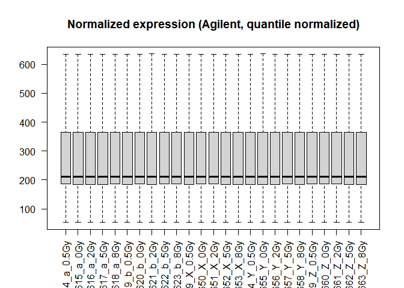
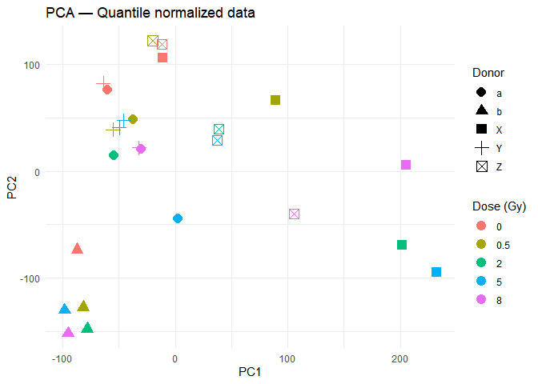
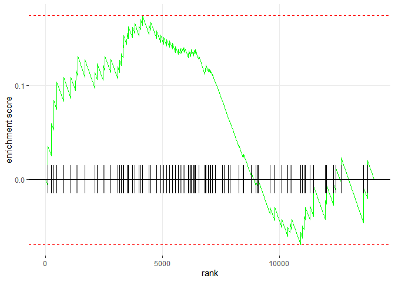

OSD-157 Analysis Report
================
Seu Nome
December 2025

``` r
setwd("C:/Users/arthu/Downloads/projeto_radiacao_PD")
```

``` r
# PACKAGE INSTALLATION AND LOADING
```

``` r
pkgs <- c("limma","edgeR","DESeq2","sva","biomaRt","fgsea","msigdbr","GSVA",
          "pheatmap","ggplot2","RColorBrewer","org.Hs.eg.db","AnnotationDbi",
          "readr","dplyr","tibble","stringr","cowplot")

to_install <- pkgs[!pkgs %in% installed.packages()[,"Package"]]
if(length(to_install)) install.packages(to_install)

# Bioconductor packages
if(!requireNamespace("BiocManager", quietly=TRUE)) install.packages("BiocManager")
bioc_pkgs <- c("affy","limma","edgeR","DESeq2","biomaRt","msigdbr","GSVA","org.Hs.eg.db")
for(p in bioc_pkgs) if(!requireNamespace(p,quietly=TRUE)) BiocManager::install(p)

library(limma)
library(fgsea)
library(msigdbr)
library(org.Hs.eg.db)
library(GSVA)
library(pheatmap)
library(ggplot2)
library(sva)

if (!requireNamespace("BiocManager", quietly = TRUE))
  install.packages("BiocManager")
BiocManager::install("sva", ask = FALSE, update = FALSE)
```

    ## 'getOption("repos")' replaces Bioconductor standard repositories, see 'help("repositories", package =
    ## "BiocManager")' for details.
    ## Replacement repositories:
    ##     CRAN: https://cran.rstudio.com/

    ## Bioconductor version 3.22 (BiocManager 1.30.27), R 4.5.1 (2025-06-13 ucrt)

    ## Warning: package(s) not installed when version(s) same as or greater than current; use `force = TRUE` to
    ##   re-install: 'sva'

``` r
library(sva)
```

``` r
# LIST FILES AND INITIAL TARGETS CREATION
```

``` r
list.files()
```

    ##  [1] "data"                   "Full_log.md"            "Full_log.R"            
    ##  [4] "Full_log.spin.R"        "Full_log.spin.Rmd"      "Full_log.tex"          
    ##  [7] "Full_log_files"         "pipeline_OSD157.R"      "results"               
    ## [10] "session_run_full_log.R"

``` r
list.files("data")
```

    ##  [1] "GLDS-157_microarray_A-AGIL-11.adf.txt"      "GLDS-157_microarray_A-AGIL-28.adf.txt"     
    ##  [3] "GLDS-157_microarray_E-GEOD-44201.raw.1.zip" "GLDS-157_microarray_E-GEOD-44201.raw.2.zip"
    ##  [5] "GLDS-157_microarray_E-GEOD-44201.raw.3.zip" "GSM1080589_GSM225985.txt"                  
    ##  [7] "GSM1080590_GSM225984.txt"                   "GSM1080591_GSM225986.txt"                  
    ##  [9] "GSM1080592_GSM225987.txt"                   "GSM1080593_GSM225988.txt"                  
    ## [11] "GSM1080594_GSM225990.txt"                   "GSM1080595_GSM225989.txt"                  
    ## [13] "GSM1080596_GSM225991.txt"                   "GSM1080597_GSM225992.txt"                  
    ## [15] "GSM1080598_GSM225993.txt"                   "GSM1080599_GSM225995.txt"                  
    ## [17] "GSM1080600_GSM225994.txt"                   "GSM1080601_GSM225996.txt"                  
    ## [19] "GSM1080602_GSM225997.txt"                   "GSM1080603_GSM225998.txt"                  
    ## [21] "GSM1080604_GSM226000.txt"                   "GSM1080605_GSM225999.txt"                  
    ## [23] "GSM1080606_GSM226001.txt"                   "GSM1080607_GSM226002.txt"                  
    ## [25] "GSM1080608_GSM226003.txt"                   "GSM1080609_GSM226005.txt"                  
    ## [27] "GSM1080610_GSM226004.txt"                   "GSM1080611_GSM226006.txt"                  
    ## [29] "GSM1080612_GSM226007.txt"                   "GSM1080613_GSM226008.txt"                  
    ## [31] "GSM1080614_a_0.5Gy.txt"                     "GSM1080615_a_0Gy.txt"                      
    ## [33] "GSM1080616_a_2Gy.txt"                       "GSM1080617_a_5Gy.txt"                      
    ## [35] "GSM1080618_a_8Gy.txt"                       "GSM1080619_b_0.5Gy.txt"                    
    ## [37] "GSM1080620_b_0Gy.txt"                       "GSM1080621_b_2Gy.txt"                      
    ## [39] "GSM1080622_b_5Gy.txt"                       "GSM1080623_b_8Gy.txt"                      
    ## [41] "GSM1080624_GSM226009.txt"                   "GSM1080625_GSM226011.txt"                  
    ## [43] "GSM1080626_GSM226010.txt"                   "GSM1080627_GSM226012.txt"                  
    ## [45] "GSM1080628_GSM226013.txt"                   "GSM1080629_GSM226014.txt"                  
    ## [47] "GSM1080630_GSM226016.txt"                   "GSM1080631_GSM226015.txt"                  
    ## [49] "GSM1080632_GSM226017.txt"                   "GSM1080633_GSM226018.txt"                  
    ## [51] "GSM1080634_GSM226019.txt"                   "GSM1080635_GSM226021.txt"                  
    ## [53] "GSM1080636_GSM226020.txt"                   "GSM1080637_GSM226022.txt"                  
    ## [55] "GSM1080638_GSM226023.txt"                   "GSM1080639_GSM226024.txt"                  
    ## [57] "GSM1080640_GSM226026.txt"                   "GSM1080641_GSM226025.txt"                  
    ## [59] "GSM1080642_GSM226027.txt"                   "GSM1080643_GSM226028.txt"                  
    ## [61] "GSM1080644_GSM226029.txt"                   "GSM1080645_GSM226031.txt"                  
    ## [63] "GSM1080646_GSM226030.txt"                   "GSM1080647_GSM226032.txt"                  
    ## [65] "GSM1080648_GSM226033.txt"                   "GSM1080649_X_0.5Gy.txt"                    
    ## [67] "GSM1080650_X_0Gy.txt"                       "GSM1080651_X_2Gy.txt"                      
    ## [69] "GSM1080652_X_5Gy.txt"                       "GSM1080653_X_8Gy.txt"                      
    ## [71] "GSM1080654_Y_0.5Gy.txt"                     "GSM1080655_Y_0Gy.txt"                      
    ## [73] "GSM1080656_Y_2Gy.txt"                       "GSM1080657_Y_5Gy.txt"                      
    ## [75] "GSM1080658_Y_8Gy.txt"                       "GSM1080659_Z_0.5Gy.txt"                    
    ## [77] "GSM1080660_Z_0Gy.txt"                       "GSM1080661_Z_2Gy.txt"                      
    ## [79] "GSM1080662_Z_5Gy.txt"                       "GSM1080663_Z_8Gy.txt"

``` r
files <- list.files("data", pattern="\\.txt$", full.names=TRUE)

# Automatically create TARGETS dataframe
targets <- data.frame(
  FileName = files,
  BaseName = basename(files)
)

# Extract Dose (number) and Donor
library(stringr)
targets$Dose <- str_extract(targets$BaseName, "[0-9\\.]+Gy")
targets$DoseNum <- as.numeric(str_extract(targets$Dose, "[0-9\\.]+"))

# Extract Donor (first character between underscores)
# ex: GSM1080614_a_0.5Gy.txt -> "a"
targets$Donor <- str_extract(targets$BaseName, "_([A-Za-z])_")
targets$Donor <- gsub("_", "", targets$Donor)

# Create SampleID
targets$SampleID <- gsub("\\.txt$", "", targets$BaseName)

head(targets)
```

    ##                                     FileName                              BaseName Dose DoseNum Donor
    ## 1 data/GLDS-157_microarray_A-AGIL-11.adf.txt GLDS-157_microarray_A-AGIL-11.adf.txt <NA>      NA  <NA>
    ## 2 data/GLDS-157_microarray_A-AGIL-28.adf.txt GLDS-157_microarray_A-AGIL-28.adf.txt <NA>      NA  <NA>
    ## 3              data/GSM1080589_GSM225985.txt              GSM1080589_GSM225985.txt <NA>      NA  <NA>
    ## 4              data/GSM1080590_GSM225984.txt              GSM1080590_GSM225984.txt <NA>      NA  <NA>
    ## 5              data/GSM1080591_GSM225986.txt              GSM1080591_GSM225986.txt <NA>      NA  <NA>
    ## 6              data/GSM1080592_GSM225987.txt              GSM1080592_GSM225987.txt <NA>      NA  <NA>
    ##                            SampleID
    ## 1 GLDS-157_microarray_A-AGIL-11.adf
    ## 2 GLDS-157_microarray_A-AGIL-28.adf
    ## 3              GSM1080589_GSM225985
    ## 4              GSM1080590_GSM225984
    ## 5              GSM1080591_GSM225986
    ## 6              GSM1080592_GSM225987

``` r
head(targets, 10)
```

    ##                                      FileName                              BaseName Dose DoseNum Donor
    ## 1  data/GLDS-157_microarray_A-AGIL-11.adf.txt GLDS-157_microarray_A-AGIL-11.adf.txt <NA>      NA  <NA>
    ## 2  data/GLDS-157_microarray_A-AGIL-28.adf.txt GLDS-157_microarray_A-AGIL-28.adf.txt <NA>      NA  <NA>
    ## 3               data/GSM1080589_GSM225985.txt              GSM1080589_GSM225985.txt <NA>      NA  <NA>
    ## 4               data/GSM1080590_GSM225984.txt              GSM1080590_GSM225984.txt <NA>      NA  <NA>
    ## 5               data/GSM1080591_GSM225986.txt              GSM1080591_GSM225986.txt <NA>      NA  <NA>
    ## 6               data/GSM1080592_GSM225987.txt              GSM1080592_GSM225987.txt <NA>      NA  <NA>
    ## 7               data/GSM1080593_GSM225988.txt              GSM1080593_GSM225988.txt <NA>      NA  <NA>
    ## 8               data/GSM1080594_GSM225990.txt              GSM1080594_GSM225990.txt <NA>      NA  <NA>
    ## 9               data/GSM1080595_GSM225989.txt              GSM1080595_GSM225989.txt <NA>      NA  <NA>
    ## 10              data/GSM1080596_GSM225991.txt              GSM1080596_GSM225991.txt <NA>      NA  <NA>
    ##                             SampleID
    ## 1  GLDS-157_microarray_A-AGIL-11.adf
    ## 2  GLDS-157_microarray_A-AGIL-28.adf
    ## 3               GSM1080589_GSM225985
    ## 4               GSM1080590_GSM225984
    ## 5               GSM1080591_GSM225986
    ## 6               GSM1080592_GSM225987
    ## 7               GSM1080593_GSM225988
    ## 8               GSM1080594_GSM225990
    ## 9               GSM1080595_GSM225989
    ## 10              GSM1080596_GSM225991

``` r
table(targets$Donor)
```

    ## 
    ## a b X Y Z 
    ## 5 5 5 5 5

``` r
table(targets$DoseNum)
```

    ## 
    ##   0 0.5   2   5   8 
    ##   5   5   5   5   5

``` r
# TARGETS CLEANUP (REDUNDANT BUT WORKING BLOCK)
```

``` r
# Load only what is needed
library(stringr)

# List .txt files in data folder (already done before)
files <- list.files("data", pattern="\\.txt$", full.names=TRUE)
targets <- data.frame(FileName = files, BaseName = basename(files), stringsAsFactors = FALSE)

# Filter only files following the pattern: _<letter>_<number>Gy (ex: _a_0.5Gy)
pattern_keep <- "_[A-Za-z]_[0-9\\.]+Gy"
targets <- targets[ grepl(pattern_keep, targets$BaseName), ]

# Explicitly extract Dose, DoseNum, Donor, and SampleID
targets$Dose <- stringr::str_extract(targets$BaseName, "[0-9\\.]+Gy")
targets$DoseNum <- as.numeric(stringr::str_extract(targets$Dose, "[0-9\\.]+"))
targets$Donor <- stringr::str_extract(targets$BaseName, "_([A-Za-z])_")
targets$Donor <- gsub("_", "", targets$Donor)
targets$SampleID <- gsub("\\.txt$", "", targets$BaseName)

# Verification
nrow(targets)
```

    ## [1] 25

``` r
head(targets, 8)
```

    ##                       FileName               BaseName  Dose DoseNum Donor           SampleID
    ## 28 data/GSM1080614_a_0.5Gy.txt GSM1080614_a_0.5Gy.txt 0.5Gy     0.5     a GSM1080614_a_0.5Gy
    ## 29   data/GSM1080615_a_0Gy.txt   GSM1080615_a_0Gy.txt   0Gy     0.0     a   GSM1080615_a_0Gy
    ## 30   data/GSM1080616_a_2Gy.txt   GSM1080616_a_2Gy.txt   2Gy     2.0     a   GSM1080616_a_2Gy
    ## 31   data/GSM1080617_a_5Gy.txt   GSM1080617_a_5Gy.txt   5Gy     5.0     a   GSM1080617_a_5Gy
    ## 32   data/GSM1080618_a_8Gy.txt   GSM1080618_a_8Gy.txt   8Gy     8.0     a   GSM1080618_a_8Gy
    ## 33 data/GSM1080619_b_0.5Gy.txt GSM1080619_b_0.5Gy.txt 0.5Gy     0.5     b GSM1080619_b_0.5Gy
    ## 34   data/GSM1080620_b_0Gy.txt   GSM1080620_b_0Gy.txt   0Gy     0.0     b   GSM1080620_b_0Gy
    ## 35   data/GSM1080621_b_2Gy.txt   GSM1080621_b_2Gy.txt   2Gy     2.0     b   GSM1080621_b_2Gy

``` r
table(targets$Donor)
```

    ## 
    ## a b X Y Z 
    ## 5 5 5 5 5

``` r
table(targets$DoseNum)
```

    ## 
    ##   0 0.5   2   5   8 
    ##   5   5   5   5   5

``` r
library(limma)
library(ggplot2)

# targets must exist starting from Block 1 (with FileName, SampleID, Donor, DoseNum)
print(head(targets))
```

    ##                       FileName               BaseName  Dose DoseNum Donor           SampleID
    ## 28 data/GSM1080614_a_0.5Gy.txt GSM1080614_a_0.5Gy.txt 0.5Gy     0.5     a GSM1080614_a_0.5Gy
    ## 29   data/GSM1080615_a_0Gy.txt   GSM1080615_a_0Gy.txt   0Gy     0.0     a   GSM1080615_a_0Gy
    ## 30   data/GSM1080616_a_2Gy.txt   GSM1080616_a_2Gy.txt   2Gy     2.0     a   GSM1080616_a_2Gy
    ## 31   data/GSM1080617_a_5Gy.txt   GSM1080617_a_5Gy.txt   5Gy     5.0     a   GSM1080617_a_5Gy
    ## 32   data/GSM1080618_a_8Gy.txt   GSM1080618_a_8Gy.txt   8Gy     8.0     a   GSM1080618_a_8Gy
    ## 33 data/GSM1080619_b_0.5Gy.txt GSM1080619_b_0.5Gy.txt 0.5Gy     0.5     b GSM1080619_b_0.5Gy

``` r
# READING AND NORMALIZATION
```

``` r
RG <- read.maimages(targets$FileName,
                    source = "agilent",
                    green.only = TRUE)
```

    ## Read data/GSM1080614_a_0.5Gy.txt 
    ## Read data/GSM1080615_a_0Gy.txt 
    ## Read data/GSM1080616_a_2Gy.txt 
    ## Read data/GSM1080617_a_5Gy.txt 
    ## Read data/GSM1080618_a_8Gy.txt 
    ## Read data/GSM1080619_b_0.5Gy.txt 
    ## Read data/GSM1080620_b_0Gy.txt 
    ## Read data/GSM1080621_b_2Gy.txt 
    ## Read data/GSM1080622_b_5Gy.txt 
    ## Read data/GSM1080623_b_8Gy.txt 
    ## Read data/GSM1080649_X_0.5Gy.txt 
    ## Read data/GSM1080650_X_0Gy.txt 
    ## Read data/GSM1080651_X_2Gy.txt 
    ## Read data/GSM1080652_X_5Gy.txt 
    ## Read data/GSM1080653_X_8Gy.txt 
    ## Read data/GSM1080654_Y_0.5Gy.txt 
    ## Read data/GSM1080655_Y_0Gy.txt 
    ## Read data/GSM1080656_Y_2Gy.txt 
    ## Read data/GSM1080657_Y_5Gy.txt 
    ## Read data/GSM1080658_Y_8Gy.txt 
    ## Read data/GSM1080659_Z_0.5Gy.txt 
    ## Read data/GSM1080660_Z_0Gy.txt 
    ## Read data/GSM1080661_Z_2Gy.txt 
    ## Read data/GSM1080662_Z_5Gy.txt 
    ## Read data/GSM1080663_Z_8Gy.txt

``` r
# Verify reading
dim(RG$E)          # probes x samples
```

    ## [1] 45015    25

``` r
colnames(RG$E)
```

    ##  [1] "data/GSM1080614_a_0.5Gy" "data/GSM1080615_a_0Gy"   "data/GSM1080616_a_2Gy"  
    ##  [4] "data/GSM1080617_a_5Gy"   "data/GSM1080618_a_8Gy"   "data/GSM1080619_b_0.5Gy"
    ##  [7] "data/GSM1080620_b_0Gy"   "data/GSM1080621_b_2Gy"   "data/GSM1080622_b_5Gy"  
    ## [10] "data/GSM1080623_b_8Gy"   "data/GSM1080649_X_0.5Gy" "data/GSM1080650_X_0Gy"  
    ## [13] "data/GSM1080651_X_2Gy"   "data/GSM1080652_X_5Gy"   "data/GSM1080653_X_8Gy"  
    ## [16] "data/GSM1080654_Y_0.5Gy" "data/GSM1080655_Y_0Gy"   "data/GSM1080656_Y_2Gy"  
    ## [19] "data/GSM1080657_Y_5Gy"   "data/GSM1080658_Y_8Gy"   "data/GSM1080659_Z_0.5Gy"
    ## [22] "data/GSM1080660_Z_0Gy"   "data/GSM1080661_Z_2Gy"   "data/GSM1080662_Z_5Gy"  
    ## [25] "data/GSM1080663_Z_8Gy"

``` r
RG.bc <- backgroundCorrect(RG, method = "normexp", offset = 50)
```

    ## Array 1 corrected
    ## Array 2 corrected
    ## Array 3 corrected
    ## Array 4 corrected
    ## Array 5 corrected
    ## Array 6 corrected
    ## Array 7 corrected
    ## Array 8 corrected
    ## Array 9 corrected
    ## Array 10 corrected
    ## Array 11 corrected
    ## Array 12 corrected
    ## Array 13 corrected
    ## Array 14 corrected
    ## Array 15 corrected
    ## Array 16 corrected
    ## Array 17 corrected
    ## Array 18 corrected
    ## Array 19 corrected
    ## Array 20 corrected
    ## Array 21 corrected
    ## Array 22 corrected
    ## Array 23 corrected
    ## Array 24 corrected
    ## Array 25 corrected

``` r
# CORRECT NORMALIZATION
# Note: Using RG.bc$E ensuring matrix output, fixing the previous 'atomic' error
expr_matrix <- normalizeBetweenArrays(RG.bc$E, method = "quantile")

# Adjust names
colnames(expr_matrix) <- targets$SampleID

boxplot(expr_matrix,
        las = 2,
        main = "Normalized expression (Agilent, quantile normalized)",
        outline = FALSE)
```

<!-- -->

``` r
library(ggplot2)
```

``` r
# PCA ANALYSIS
```

``` r
# Remove completely NA rows (if exist)
expr_no_na <- expr_matrix[complete.cases(expr_matrix), ]

# PCA with centering and scaling
pca <- prcomp(t(expr_no_na), scale. = TRUE)

# Dataframe for plot
df_pca <- data.frame(
  PC1 = pca$x[,1],
  PC2 = pca$x[,2],
  Dose = as.factor(targets$DoseNum),
  Donor = as.factor(targets$Donor),
  Sample = targets$SampleID
)

# Plot base R (simple and ensures running without ggplot)
plot(df_pca$PC1, df_pca$PC2,
     col = df_pca$Dose,
     pch = as.numeric(df_pca$Donor),
     xlab = "PC1",
     ylab = "PC2",
     main = "PCA – Normalized Agilent Microarrays")

legend("topright",
       legend = paste("Dose =", sort(unique(targets$DoseNum))),
       col = 1:length(unique(targets$DoseNum)),
       pch = 16)
```

<!-- -->

``` r
summary(pca)
```

    ## Importance of components:
    ##                            PC1     PC2     PC3      PC4      PC5      PC6      PC7      PC8      PC9
    ## Standard deviation     95.8499 83.9646 65.5325 55.94424 47.33418 43.21560 40.89160 40.61624 36.49160
    ## Proportion of Variance  0.2041  0.1566  0.0954  0.06953  0.04977  0.04149  0.03715  0.03665  0.02958
    ## Cumulative Proportion   0.2041  0.3607  0.4561  0.52564  0.57541  0.61690  0.65404  0.69069  0.72027
    ##                            PC10    PC11     PC12     PC13     PC14    PC15     PC16     PC17     PC18
    ## Standard deviation     35.21353 34.2770 33.54053 33.36139 32.09164 30.6016 29.49391 29.33916 28.24864
    ## Proportion of Variance  0.02755  0.0261  0.02499  0.02472  0.02288  0.0208  0.01932  0.01912  0.01773
    ## Cumulative Proportion   0.74782  0.7739  0.79891  0.82363  0.84651  0.8673  0.88664  0.90576  0.92349
    ##                            PC19     PC20     PC21     PC22     PC23   PC24      PC25
    ## Standard deviation     26.98848 26.42586 25.19845 23.27956 20.86971 20.123 3.683e-13
    ## Proportion of Variance  0.01618  0.01551  0.01411  0.01204  0.00968  0.009 0.000e+00
    ## Cumulative Proportion   0.93967  0.95518  0.96929  0.98133  0.99100  1.000 1.000e+00

``` r
ggplot(df_pca, aes(PC1, PC2, color = Dose, shape = Donor)) +
  geom_point(size = 4) +
  theme_minimal() +
  labs(
    title = "PCA — Quantile normalized data",
    color = "Dose (Gy)",
    shape = "Donor"
  )
```

<!-- -->

``` r
# BLOCK 3 — Dose-response modeling + limma
```

``` r
## Ensure meta/targets is loaded correctly
meta <- targets
meta$Donor <- factor(meta$Donor)
meta$DoseNum <- as.numeric(meta$DoseNum)

## 3.1 — Create design matrix
design <- model.matrix(~ DoseNum + Donor, data = meta)
design
```

    ##    (Intercept) DoseNum Donorb DonorX DonorY DonorZ
    ## 28           1     0.5      0      0      0      0
    ## 29           1     0.0      0      0      0      0
    ## 30           1     2.0      0      0      0      0
    ## 31           1     5.0      0      0      0      0
    ## 32           1     8.0      0      0      0      0
    ## 33           1     0.5      1      0      0      0
    ## 34           1     0.0      1      0      0      0
    ## 35           1     2.0      1      0      0      0
    ## 36           1     5.0      1      0      0      0
    ## 37           1     8.0      1      0      0      0
    ## 63           1     0.5      0      1      0      0
    ## 64           1     0.0      0      1      0      0
    ## 65           1     2.0      0      1      0      0
    ## 66           1     5.0      0      1      0      0
    ## 67           1     8.0      0      1      0      0
    ## 68           1     0.5      0      0      1      0
    ## 69           1     0.0      0      0      1      0
    ## 70           1     2.0      0      0      1      0
    ## 71           1     5.0      0      0      1      0
    ## 72           1     8.0      0      0      1      0
    ## 73           1     0.5      0      0      0      1
    ## 74           1     0.0      0      0      0      1
    ## 75           1     2.0      0      0      0      1
    ## 76           1     5.0      0      0      0      1
    ## 77           1     8.0      0      0      0      1
    ## attr(,"assign")
    ## [1] 0 1 2 2 2 2
    ## attr(,"contrasts")
    ## attr(,"contrasts")$Donor
    ## [1] "contr.treatment"

``` r
## 3.2 — Fit limma model
fit <- lmFit(expr_matrix, design)
fit <- eBayes(fit)

## 3.3 — Extract table for continuous coefficient "DoseNum"
res_trend <- topTable(
  fit,
  coef = "DoseNum",
  number = Inf,
  sort.by = "P"
)

## View first rows
head(res_trend)
```

    ##            logFC  AveExpr         t      P.Value    adj.P.Val        B
    ## 10483  12.442801 257.9863  13.09769 3.706154e-11 1.668325e-06 14.94081
    ## 29838 116.533148 613.8394  11.16896 5.931965e-10 1.335137e-05 12.58090
    ## 13976   6.366956 201.8487  10.58009 1.486488e-09 2.230475e-05 11.77452
    ## 19380  46.683689 423.4883  10.24573 2.546034e-09 2.748208e-05 11.29709
    ## 37046  -2.124861 205.4202 -10.04886 3.515488e-09 2.748208e-05 11.00914
    ## 39026  13.021700 327.3085  10.02396 3.663056e-09 2.748208e-05 10.97235

``` r
## 3.4 — How many significant genes (FDR < 0.05)?
sig_count <- sum(res_trend$adj.P.Val < 0.05)
sig_count
```

    ## [1] 6703

``` r
## 3.5 — Save full table
if (!dir.exists("results")) dir.create("results")

write.csv(
  res_trend,
  file = "results/OSD157_trend_per_gene.csv",
  row.names = TRUE
)

library(fgsea)
library(GSVA)
library(msigdbr)
```

``` r
# GENE SETS PREPARATION (Hallmark & KEGG)
```

``` r
## Ranking: use t-statistic of DoseNum coefficient
gene_ranking <- res_trend$t
names(gene_ranking) <- rownames(res_trend)

## Descending order (required by fgsea)
gene_ranking <- sort(gene_ranking, decreasing = TRUE)

m_df <- msigdbr(species = "Homo sapiens")

# removed erroneous gs_cat subsetting line here

colnames(m_df)
```

    ##  [1] "gene_symbol"        "ncbi_gene"          "ensembl_gene"       "db_gene_symbol"    
    ##  [5] "db_ncbi_gene"       "db_ensembl_gene"    "source_gene"        "gs_id"             
    ##  [9] "gs_name"            "gs_collection"      "gs_subcollection"   "gs_collection_name"
    ## [13] "gs_description"     "gs_source_species"  "gs_pmid"            "gs_geoid"          
    ## [17] "gs_exact_source"    "gs_url"             "db_version"         "db_target_species"

``` r
##############################################################
### Get Hallmark (new msigdbr version)
##############################################################
hallmark <- m_df[m_df$gs_collection == "H", c("gs_name", "gene_symbol")]
hallmark_list <- split(hallmark$gene_symbol, hallmark$gs_name)

##############################################################
### Get KEGG (new msigdbr version)
##############################################################
kegg <- m_df[
  m_df$gs_collection == "C2" &
    m_df$gs_subcollection == "CP:KEGG",
  c("gs_name", "gene_symbol")
]
kegg_list <- split(kegg$gene_symbol, kegg$gs_name)

length(hallmark_list)
```

    ## [1] 50

``` r
length(kegg_list)
```

    ## [1] 0

``` r
head(hallmark)
```

    ## # A tibble: 6 × 2
    ##   gs_name               gene_symbol
    ##   <chr>                 <chr>      
    ## 1 HALLMARK_ADIPOGENESIS ABCA1      
    ## 2 HALLMARK_ADIPOGENESIS ABCB8      
    ## 3 HALLMARK_ADIPOGENESIS ACAA2      
    ## 4 HALLMARK_ADIPOGENESIS ACADL      
    ## 5 HALLMARK_ADIPOGENESIS ACADM      
    ## 6 HALLMARK_ADIPOGENESIS ACADS

``` r
head(kegg)
```

    ## # A tibble: 0 × 2
    ## # ℹ 2 variables: gs_name <chr>, gene_symbol <chr>

``` r
unique(m_df$gs_collection)
```

    ## [1] "C3" "C2" "C8" "C6" "C7" "C4" "C5" "H"  "C1"

``` r
unique(m_df$gs_subcollection)
```

    ##  [1] "MIR:MIR_LEGACY"  "TFT:TFT_LEGACY"  "CGP"             "TFT:GTRD"        ""               
    ##  [6] "VAX"             "CP:BIOCARTA"     "CGN"             "3CA"             "GO:BP"          
    ## [11] "GO:CC"           "IMMUNESIGDB"     "GO:MF"           "HPO"             "CP:KEGG_LEGACY" 
    ## [16] "CP:KEGG_MEDICUS" "MIR:MIRDB"       "CM"              "CP:PID"          "CP:REACTOME"    
    ## [21] "CP"              "CP:WIKIPATHWAYS"

``` r
unique(m_df$gs_collection_name)
```

    ##  [1] "MIR_Legacy"                           "TFT_Legacy"                          
    ##  [3] "Chemical and Genetic Perturbations"   "GTRD"                                
    ##  [5] "Cell Type Signature"                  "Oncogenic Signature"                 
    ##  [7] "HIPC Vaccine Response"                "BioCarta Pathways"                   
    ##  [9] "Cancer Gene Neighborhoods"            "Curated Cancer Cell Atlas gene sets "
    ## [11] "GO Biological Process"                "GO Cellular Component"               
    ## [13] "ImmuneSigDB"                          "GO Molecular Function"               
    ## [15] "Hallmark"                             "Human Phenotype Ontology"            
    ## [17] "KEGG Legacy Pathways"                 "KEGG Medicus Pathways"               
    ## [19] "miRDB"                                "Cancer Modules"                      
    ## [21] "Positional"                           "PID Pathways"                        
    ## [23] "Reactome Pathways"                    "Canonical Pathways"                  
    ## [25] "WikiPathways"

``` r
kegg <- m_df[
  m_df$gs_subcollection %in% c("CP:KEGG_LEGACY", "CP:KEGG_MEDICUS"),
  c("gs_name", "gene_symbol")
]

kegg_list <- split(kegg$gene_symbol, kegg$gs_name)

length(kegg_list)
```

    ## [1] 844

``` r
head(kegg)
```

    ## # A tibble: 6 × 2
    ##   gs_name               gene_symbol
    ##   <chr>                 <chr>      
    ## 1 KEGG_ABC_TRANSPORTERS ABCA1      
    ## 2 KEGG_ABC_TRANSPORTERS ABCA10     
    ## 3 KEGG_ABC_TRANSPORTERS ABCA12     
    ## 4 KEGG_ABC_TRANSPORTERS ABCA13     
    ## 5 KEGG_ABC_TRANSPORTERS ABCA2      
    ## 6 KEGG_ABC_TRANSPORTERS ABCA3

``` r
pd_sets <- unique(kegg$gs_name[grepl("PARKINSON", kegg$gs_name, ignore.case = TRUE)])
pd_sets
```

    ## [1] "KEGG_PARKINSONS_DISEASE"

``` r
length(pd_sets)
```

    ## [1] 1

``` r
pd_kegg_sets <- kegg_list[pd_sets]
pd_kegg_sets
```

    ## $KEGG_PARKINSONS_DISEASE
    ##   [1] "APAF1"     "ATP5F1A"   "ATP5F1B"   "ATP5F1C"   "ATP5F1D"   "ATP5F1E"   "ATP5MC1"   "ATP5MC1P5"
    ##   [9] "ATP5MC2"   "ATP5MC3"   "ATP5PB"    "ATP5PD"    "ATP5PF"    "ATP5PO"    "CASP3"     "CASP9"    
    ##  [17] "COX4I1"    "COX4I2"    "COX5A"     "COX5B"     "COX6A1"    "COX6A2"    "COX6B1"    "COX6B2"   
    ##  [25] "COX6C"     "COX6CP3"   "COX7A1"    "COX7A2"    "COX7A2L"   "COX7B"     "COX7B2"    "COX7C"    
    ##  [33] "COX8A"     "COX8C"     "CYC1"      "CYCS"      "GPR37"     "HTRA2"     "LRRK2"     "MT-ATP6"  
    ##  [41] "MT-ATP8"   "MT-CO1"    "MT-CO2"    "MT-CO3"    "MT-CYB"    "MT-ND1"    "MT-ND2"    "MT-ND3"   
    ##  [49] "MT-ND4"    "MT-ND4L"   "MT-ND5"    "MT-ND6"    "NDUFA1"    "NDUFA10"   "NDUFA2"    "NDUFA3"   
    ##  [57] "NDUFA4"    "NDUFA4L2"  "NDUFA5"    "NDUFA6"    "NDUFA7"    "NDUFA8"    "NDUFA9"    "NDUFAB1"  
    ##  [65] "NDUFB1"    "NDUFB10"   "NDUFB2"    "NDUFB3"    "NDUFB4"    "NDUFB5"    "NDUFB6"    "NDUFB7"   
    ##  [73] "NDUFB8"    "NDUFB9"    "NDUFC1"    "NDUFC2"    "NDUFS1"    "NDUFS2"    "NDUFS3"    "NDUFS4"   
    ##  [81] "NDUFS5"    "NDUFS6"    "NDUFS7"    "NDUFS8"    "NDUFV1"    "NDUFV2"    "NDUFV3"    "PARK7"    
    ##  [89] "PINK1"     "PPID"      "PRKN"      "SDHA"      "SDHB"      "SDHC"      "SDHCP5"    "SDHD"     
    ##  [97] "SEPTIN5"   "SLC18A1"   "SLC18A2"   "SLC25A31"  "SLC25A4"   "SLC25A5"   "SLC25A6"   "SLC25A6"  
    ## [105] "SLC6A3"    "SNCA"      "SNCAIP"    "TH"        "UBA1"      "UBA7"      "UBB"       "UBE2G1"   
    ## [113] "UBE2G2"    "UBE2J1"    "UBE2J2"    "UBE2L3"    "UBE2L6"    "UCHL1"     "UQCR10"    "UQCR10P1" 
    ## [121] "UQCR11"    "UQCRB"     "UQCRC1"    "UQCRC2"    "UQCRFS1"   "UQCRH"     "UQCRHL"    "UQCRQ"    
    ## [129] "VDAC1"     "VDAC2"     "VDAC2P5"   "VDAC3"

``` r
# Removed the preliminary fgsea call that had warnings
```

``` r
# PROBE ANNOTATION (Working Method)
```

``` r
# 1. Extract gene symbols from the RG object itself (Reliable method)
probe2gene <- RG$genes$GeneName

# 2. Ensure expr_matrix and probe2gene have the same size
length(probe2gene) == nrow(expr_matrix)
```

    ## [1] TRUE

``` r
# 3. Remove probes without annotated gene
valid <- !is.na(probe2gene) & probe2gene != "" & probe2gene != "DarkCorner" & probe2gene != "GE_BrightCorner"
expr_valid <- expr_matrix[valid, ]
gene_valid <- probe2gene[valid]

# 4. Collapse duplicate probes by gene (mean)
expr_by_gene <- limma::avereps(expr_valid, ID = gene_valid)

# 5. Check dimensions
dim(expr_by_gene)
```

    ## [1] 30587    25

``` r
head(rownames(expr_by_gene))
```

    ## [1] "APOBEC3B"   "AA085955"   "ATP11B"     "AK092846"   "DNAJA1"     "THC2741789"

``` r
# RE-RANKING AND GSEA EXECUTION
```

``` r
# 1. Create ranking for GSEA from the limma model fitted (trend)
gene_ranking <- res_trend$logFC
names(gene_ranking) <- rownames(res_trend)

# 2. Ensure only genes present in the collapsed matrix are used
gene_ranking <- gene_ranking[names(gene_ranking) %in% rownames(expr_by_gene)]
gene_ranking <- sort(gene_ranking, decreasing = TRUE)

# 3. Run KEGG Parkinsons with fgseaMultilevel
# Note: Using stats ranking
gsea_pd_kegg <- fgsea::fgseaMultilevel(
  pathways = pd_kegg_sets,
  stats = gene_ranking
)
```

    ## Warning in preparePathwaysAndStats(pathways, stats, minSize, maxSize, gseaParam, : All values in the
    ## stats vector are greater than zero and scoreType is "std", maybe you should switch to scoreType =
    ## "pos".

``` r
gsea_pd_kegg
```

    ## data.table vazia (0 linhas e 8 colunas): pathway,pval,padj,log2err,ES,NES...

``` r
# Recalculate ranking from t-statistics (more robust)
fit <- lmFit(expr_by_gene, design)
fit <- eBayes(fit)

gene_ranking <- fit$t[, "DoseNum"]
length(gene_ranking)
```

    ## [1] 30587

``` r
head(gene_ranking)
```

    ##   APOBEC3B   AA085955     ATP11B   AK092846     DNAJA1 THC2741789 
    ## 2.07798572 1.77883775 0.00526182 1.55378735 4.09589597 1.01110561

``` r
summary(gene_ranking)
```

    ##      Min.   1st Qu.    Median      Mean   3rd Qu.      Max. 
    ## -9.364667 -1.172332  0.239188 -0.001967  1.414579 13.108434

``` r
min(gene_ranking)
```

    ## [1] -9.364667

``` r
sum(names(gene_ranking) %in% unlist(pd_kegg_sets))
```

    ## [1] 93

``` r
intersect(names(gene_ranking), unlist(pd_kegg_sets))[1:30]
```

    ##  [1] "NDUFB9"   "COX7A1"   "COX4I2"   "NDUFV2"   "VDAC3"    "SNCA"     "UBE2L3"   "COX6A1"   "SLC25A31"
    ## [10] "UBE2L6"   "VDAC2"    "NDUFA6"   "NDUFA4"   "CASP3"    "NDUFB5"   "NDUFC1"   "UBE2G1"   "SDHA"    
    ## [19] "UBE2G2"   "SNCAIP"   "NDUFA9"   "COX6B1"   "UBB"      "UQCRH"    "GPR37"    "COX6A2"   "UQCRC1"  
    ## [28] "SLC18A1"  "COX7A2L"  "COX4I1"

``` r
head(names(gene_ranking), 50)
```

    ##  [1] "APOBEC3B"        "AA085955"        "ATP11B"          "AK092846"        "DNAJA1"         
    ##  [6] "THC2741789"      "EHMT2"           "RPL23"           "T12590"          "A_24_P704878"   
    ## [11] "RPS13"           "AK021474"        "HDDC3"           "PRNP"            "AK091028"       
    ## [16] "LOC150759"       "A_24_P799245"    "KIAA0101"        "AK026647"        "MEGF11"         
    ## [21] "APBA3"           "RCP9"            "C19orf15"        "KBTBD4"          "AY358224"       
    ## [26] "LRP1"            "TSC1"            "AT_D_3"          "THC2487640"      "ADORA3"         
    ## [31] "GOLGA3"          "THC2596047"      "CDH6"            "CD99L2"          "AI287491"       
    ## [36] "SMG7"            "AK097214"        "C9orf30"         "CXorf57"         "THC2648397"     
    ## [41] "VASH1"           "SRF"             "AK094799"        "THC2633633"      "BBX"            
    ## [46] "SLC7A1"          "A_24_P52168"     "A_24_P530900"    "ENST00000296149" "YWHAZ"

``` r
library(org.Hs.eg.db)

valid_hgnc <- keys(org.Hs.eg.db, keytype = "SYMBOL")

ranking_valid <- gene_ranking[names(gene_ranking) %in% valid_hgnc]

length(ranking_valid)
```

    ## [1] 14054

``` r
sum(names(ranking_valid) %in% unlist(pd_kegg_sets))
```

    ## [1] 91

``` r
ranking_valid <- sort(ranking_valid, decreasing = TRUE)

gsea_pd_kegg <- fgsea::fgseaMultilevel(
  pathways = pd_kegg_sets,
  stats = ranking_valid
)
gsea_pd_kegg
```

    ##                    pathway      pval      padj    log2err       ES       NES  size  leadingEdge
    ##                     <char>     <num>     <num>      <num>    <num>     <num> <int>       <list>
    ## 1: KEGG_PARKINSONS_DISEASE 0.9018987 0.9018987 0.07235709 0.173958 0.7996458    91 SNCA, CY....

``` r
plotEnrichment(
  pd_kegg_sets[[1]],
  ranking_valid
)
```

<!-- -->

``` r
fgsea::plotGseaTable(
  pd_kegg_sets,
  ranking_valid,
  gsea_pd_kegg,
  gseaParam = 1
)
```

<!-- -->

``` r
# FINAL REPORT GENERATION AND SAVING
```

``` r
# Required packages
required <- c("fgsea","msigdbr","pheatmap","ggplot2","cowplot","data.table")
for(pkg in required) if(!requireNamespace(pkg, quietly=TRUE)) install.packages(pkg)
library(fgsea); library(msigdbr); library(pheatmap); library(ggplot2); library(cowplot); library(data.table)

# Output folder
if(!dir.exists("results")) dir.create("results")
if(!dir.exists("results/figs")) dir.create("results/figs")

# Defensive checks: main objects
if(!exists("ranking_valid")) stop("Error: ranking_valid does not exist. Run Block 4 (collapse and ranking) first.")
if(!exists("expr_by_gene")) stop("Error: expr_by_gene does not exist. Run gene collapse first.")
if(!exists("meta")) stop("Error: meta/targets does not exist. Run Block 1.")
if(!exists("pd_kegg_sets")){
  # try to reconstruct from kegg_list if it exists
  if(exists("kegg_list")){
    pd_names <- names(kegg_list)[grepl("PARKINSON", names(kegg_list), ignore.case=TRUE)]
    pd_kegg_sets <- kegg_list[pd_names]
    if(length(pd_kegg_sets)==0) stop("pd_kegg_sets not found automatically. Check kegg_list.")
  } else stop("pd_kegg_sets does not exist and kegg_list is not available.")
}

# Ensure names in ranking
if(is.null(names(ranking_valid))) stop("ranking_valid must be a named vector (names = gene symbols).")

if(!exists("hallmark_list")){
  m_df <- msigdbr(species = "Homo sapiens")
  hallmark_df <- m_df[m_df$gs_collection == "H" , c("gs_name","gene_symbol")]
  hallmark_list <- split(hallmark_df$gene_symbol, hallmark_df$gs_name)
}

# Run fgseaMultilevel robustly (uses multilevel if possible)
message("Running Hallmark GSEA (fgseaMultilevel)... please wait")
```

    ## Running Hallmark GSEA (fgseaMultilevel)... please wait

``` r
gsea_hallmark <- fgsea::fgseaMultilevel(pathways = hallmark_list,
                                        stats = ranking_valid,
                                        eps = 0)  # eps=0 allows maximum precision
```

    ## Warning in serialize(data, node$con): 'package:stats' pode não estar disponível ao carregar
    ## Warning in serialize(data, node$con): 'package:stats' pode não estar disponível ao carregar
    ## Warning in serialize(data, node$con): 'package:stats' pode não estar disponível ao carregar
    ## Warning in serialize(data, node$con): 'package:stats' pode não estar disponível ao carregar
    ## Warning in serialize(data, node$con): 'package:stats' pode não estar disponível ao carregar
    ## Warning in serialize(data, node$con): 'package:stats' pode não estar disponível ao carregar
    ## Warning in serialize(data, node$con): 'package:stats' pode não estar disponível ao carregar
    ## Warning in serialize(data, node$con): 'package:stats' pode não estar disponível ao carregar
    ## Warning in serialize(data, node$con): 'package:stats' pode não estar disponível ao carregar
    ## Warning in serialize(data, node$con): 'package:stats' pode não estar disponível ao carregar
    ## Warning in serialize(data, node$con): 'package:stats' pode não estar disponível ao carregar
    ## Warning in serialize(data, node$con): 'package:stats' pode não estar disponível ao carregar

``` r
gsea_hallmark <- as.data.table(gsea_hallmark)[order(padj)]

# Save table
fwrite(gsea_hallmark, "results/GSEA_hallmark_multilevel.tsv", sep="\t")

if(exists("kegg_list")){
  message("Running KEGG GSEA (multilevel)...")
  gsea_kegg <- fgsea::fgseaMultilevel(pathways = kegg_list, stats = ranking_valid, eps = 0)
  gsea_kegg <- as.data.table(gsea_kegg)[order(padj)]
  fwrite(gsea_kegg, "results/GSEA_kegg_multilevel.tsv", sep="\t")
}
```

    ## Running KEGG GSEA (multilevel)...

    ## Warning in serialize(data, node$con): 'package:stats' pode não estar disponível ao carregar
    ## Warning in serialize(data, node$con): 'package:stats' pode não estar disponível ao carregar
    ## Warning in serialize(data, node$con): 'package:stats' pode não estar disponível ao carregar
    ## Warning in serialize(data, node$con): 'package:stats' pode não estar disponível ao carregar
    ## Warning in serialize(data, node$con): 'package:stats' pode não estar disponível ao carregar
    ## Warning in serialize(data, node$con): 'package:stats' pode não estar disponível ao carregar
    ## Warning in serialize(data, node$con): 'package:stats' pode não estar disponível ao carregar
    ## Warning in serialize(data, node$con): 'package:stats' pode não estar disponível ao carregar
    ## Warning in serialize(data, node$con): 'package:stats' pode não estar disponível ao carregar
    ## Warning in serialize(data, node$con): 'package:stats' pode não estar disponível ao carregar
    ## Warning in serialize(data, node$con): 'package:stats' pode não estar disponível ao carregar
    ## Warning in serialize(data, node$con): 'package:stats' pode não estar disponível ao carregar
    ## Warning in serialize(data, node$con): 'package:stats' pode não estar disponível ao carregar
    ## Warning in serialize(data, node$con): 'package:stats' pode não estar disponível ao carregar
    ## Warning in serialize(data, node$con): 'package:stats' pode não estar disponível ao carregar

``` r
warnings()
```

    ## Mensagens de aviso:
    ## 1: In serialize(data, node$con) :
    ##   'package:stats' pode não estar disponível ao carregar
    ## 2: In serialize(data, node$con) :
    ##   'package:stats' pode não estar disponível ao carregar
    ## 3: In serialize(data, node$con) :
    ##   'package:stats' pode não estar disponível ao carregar
    ## 4: In serialize(data, node$con) :
    ##   'package:stats' pode não estar disponível ao carregar
    ## 5: In serialize(data, node$con) :
    ##   'package:stats' pode não estar disponível ao carregar
    ## 6: In serialize(data, node$con) :
    ##   'package:stats' pode não estar disponível ao carregar
    ## 7: In serialize(data, node$con) :
    ##   'package:stats' pode não estar disponível ao carregar
    ## 8: In serialize(data, node$con) :
    ##   'package:stats' pode não estar disponível ao carregar
    ## 9: In serialize(data, node$con) :
    ##   'package:stats' pode não estar disponível ao carregar
    ## 10: In serialize(data, node$con) :
    ##   'package:stats' pode não estar disponível ao carregar
    ## 11: In serialize(data, node$con) :
    ##   'package:stats' pode não estar disponível ao carregar
    ## 12: In serialize(data, node$con) :
    ##   'package:stats' pode não estar disponível ao carregar
    ## 13: In serialize(data, node$con) :
    ##   'package:stats' pode não estar disponível ao carregar
    ## 14: In serialize(data, node$con) :
    ##   'package:stats' pode não estar disponível ao carregar
    ## 15: In serialize(data, node$con) :
    ##   'package:stats' pode não estar disponível ao carregar
    ## 16: In serialize(data, node$con) :
    ##   'package:stats' pode não estar disponível ao carregar

``` r
warnings()
```

    ## Mensagens de aviso:
    ## 1: In serialize(data, node$con) :
    ##   'package:stats' pode não estar disponível ao carregar
    ## 2: In serialize(data, node$con) :
    ##   'package:stats' pode não estar disponível ao carregar
    ## 3: In serialize(data, node$con) :
    ##   'package:stats' pode não estar disponível ao carregar
    ## 4: In serialize(data, node$con) :
    ##   'package:stats' pode não estar disponível ao carregar
    ## 5: In serialize(data, node$con) :
    ##   'package:stats' pode não estar disponível ao carregar
    ## 6: In serialize(data, node$con) :
    ##   'package:stats' pode não estar disponível ao carregar
    ## 7: In serialize(data, node$con) :
    ##   'package:stats' pode não estar disponível ao carregar
    ## 8: In serialize(data, node$con) :
    ##   'package:stats' pode não estar disponível ao carregar
    ## 9: In serialize(data, node$con) :
    ##   'package:stats' pode não estar disponível ao carregar
    ## 10: In serialize(data, node$con) :
    ##   'package:stats' pode não estar disponível ao carregar
    ## 11: In serialize(data, node$con) :
    ##   'package:stats' pode não estar disponível ao carregar
    ## 12: In serialize(data, node$con) :
    ##   'package:stats' pode não estar disponível ao carregar
    ## 13: In serialize(data, node$con) :
    ##   'package:stats' pode não estar disponível ao carregar
    ## 14: In serialize(data, node$con) :
    ##   'package:stats' pode não estar disponível ao carregar
    ## 15: In serialize(data, node$con) :
    ##   'package:stats' pode não estar disponível ao carregar
    ## 16: In serialize(data, node$con) :
    ##   'package:stats' pode não estar disponível ao carregar

``` r
head(gsea_hallmark, 10)
```

    ##                                        pathway         pval         padj   log2err         ES
    ##                                         <char>        <num>        <num>     <num>      <num>
    ##  1:                       HALLMARK_P53_PATHWAY 1.001376e-12 5.006878e-11 0.9101197  0.4701357
    ##  2:             HALLMARK_INFLAMMATORY_RESPONSE 4.301096e-08 1.075274e-06 0.7195128  0.3889771
    ##  3:           HALLMARK_TNFA_SIGNALING_VIA_NFKB 1.403881e-07 2.339802e-06 0.6901325  0.3851003
    ##  4:                      HALLMARK_ADIPOGENESIS 4.129713e-07 5.162141e-06 0.6749629  0.3823564
    ##  5:                    HALLMARK_G2M_CHECKPOINT 2.825547e-06 2.825547e-05 0.6272567 -0.4247903
    ##  6: HALLMARK_EPITHELIAL_MESENCHYMAL_TRANSITION 8.542009e-06 7.118341e-05 0.5933255  0.3478886
    ##  7:             HALLMARK_XENOBIOTIC_METABOLISM 1.076756e-05 7.691114e-05 0.5933255  0.3414515
    ##  8:               HALLMARK_ALLOGRAFT_REJECTION 2.360909e-05 1.385551e-04 0.5756103 -0.3901980
    ##  9:                        HALLMARK_COMPLEMENT 2.493992e-05 1.385551e-04 0.5756103  0.3267213
    ## 10:                       HALLMARK_COAGULATION 3.502536e-05 1.751268e-04 0.5573322  0.3645191
    ##           NES  size  leadingEdge
    ##         <num> <int>       <list>
    ##  1:  2.362407   178 PLK2, MD....
    ##  2:  1.985796   191 CD70, CD....
    ##  3:  1.959946   184 PLK2, CD....
    ##  4:  1.921321   178 CMBL, AP....
    ##  5: -1.900897   171 E2F3, TA....
    ##  6:  1.781578   189 ACTA2, T....
    ##  7:  1.743169   191 TMEM176B....
    ##  8: -1.769979   188 PTPRC, C....
    ##  9:  1.659197   193 PLAUR, A....
    ## 10:  1.760892   136 F12, SIR....

``` r
head(gsea_kegg, 10)
```

    ##                                                                                  pathway         pval
    ##                                                                                   <char>        <num>
    ##  1:                                        KEGG_MEDICUS_REFERENCE_TRANSLATION_INITIATION 6.898926e-21
    ##  2:                                                                        KEGG_RIBOSOME 4.111750e-18
    ##  3:                                                                        KEGG_LYSOSOME 5.192230e-15
    ##  4: KEGG_MEDICUS_REFERENCE_ANTIGEN_PROCESSING_AND_PRESENTATION_BY_MHC_CLASS_II_MOLECULES 1.432602e-07
    ##  5:                                                                          KEGG_ASTHMA 2.020786e-07
    ##  6:                       KEGG_MEDICUS_PATHOGEN_HTLV_1_TAX_TO_NFY_MEDIATED_TRANSCRIPTION 4.153375e-07
    ##  7:                                       KEGG_NATURAL_KILLER_CELL_MEDIATED_CYTOTOXICITY 6.062055e-07
    ##  8:                                                            KEGG_LEISHMANIA_INFECTION 1.165823e-06
    ##  9:                                                                     KEGG_SPLICEOSOME 1.204440e-06
    ## 10:                                                        KEGG_OTHER_GLYCAN_DEGRADATION 2.212618e-05
    ##             padj   log2err         ES       NES  size  leadingEdge
    ##            <num>     <num>      <num>     <num> <int>       <list>
    ##  1: 5.822693e-18 1.1778933 -0.7327255 -2.894196    81 RPS14, R....
    ##  2: 1.735159e-15 1.0959293 -0.7014822 -2.812160    86 RPS21, R....
    ##  3: 1.460747e-12 0.9969862  0.5684154  2.689295   116 AP3S2, S....
    ##  4: 3.022790e-05 0.6901325  0.8360682  2.492567    15 HLA-DMA,....
    ##  5: 3.411087e-05 0.6901325  0.6865508  2.427750    30 FCER1G, ....
    ##  6: 5.842414e-05 0.6749629  0.8197306  2.443860    15 HLA-DMA,....
    ##  7: 7.309107e-05 0.6594444 -0.4729810 -2.014809   122 ICAM2, K....
    ##  8: 1.129497e-04 0.6435518  0.5177886  2.213188    66 FCGR2A, ....
    ##  9: 1.129497e-04 0.6435518 -0.5060297 -2.058310    94 SNRPD2, ....
    ## 10: 1.867450e-03 0.5756103  0.7746218  2.274645    14 NEU1, HE....

``` r
gsea_kegg[gsea_kegg$pathway == "KEGG_PARKINSONS_DISEASE"]
```

    ##                    pathway      pval      padj    log2err       ES       NES  size  leadingEdge
    ##                     <char>     <num>     <num>      <num>    <num>     <num> <int>       <list>
    ## 1: KEGG_PARKINSONS_DISEASE 0.9210526 0.9609004 0.07325587 0.173958 0.7892453    91 SNCA, CY....
